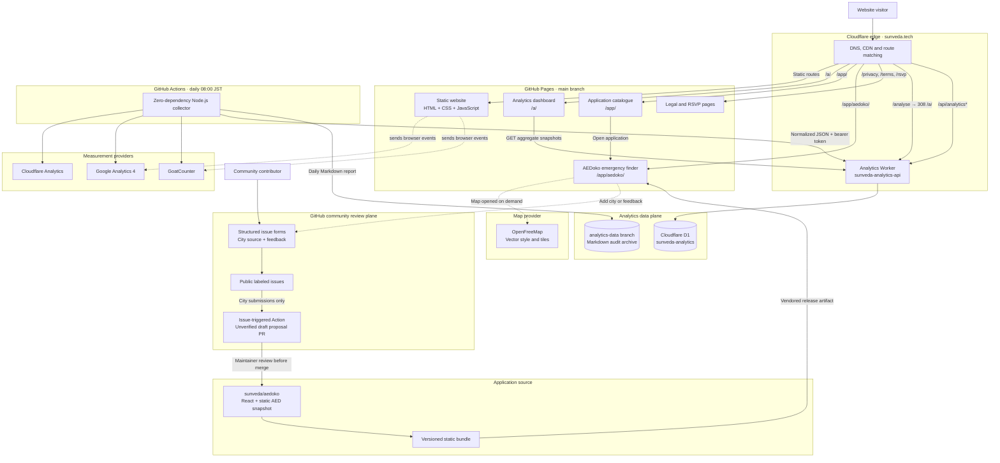

# SunVeda Technologies

Source for [sunveda.tech](https://sunveda.tech), Sarveshwar Singh's multilingual technology consulting and portfolio website.

**Current architecture revision: A7 · On-demand AED map (2026-08-30)**

This README is the architecture source of truth. The diagrams, deployment map,
and architecture history must be updated in the same pull request whenever a
change affects hosting, runtime services, public routes, APIs, data storage,
automation, external integrations, or security boundaries.

## Current architecture



### Deployment map

| Component | Technology | Deployed to | Source |
| --- | --- | --- | --- |
| Main website | Plain HTML, inline CSS, browser JavaScript | GitHub Pages from `main` | `index.html`, `i18n.js` |
| Analytics dashboard | Plain HTML, inline CSS, SVG and browser JavaScript | GitHub Pages from `main` | `a/index.html` |
| Application catalogue | Plain HTML, inline CSS and shared client-side translations | GitHub Pages route `/app/` | `app/index.html`, `i18n.js` |
| AEDoko application | Static React bundle with a committed AED data snapshot | GitHub Pages route `/app/aedoko/` | `app/aedoko/`, built from [`sunveda/aedoko`](https://github.com/sunveda/aedoko) |
| AEDoko interactive map | Lazy MapLibre GL bundle, browser-side GeoJSON clustering, and OpenFreeMap vector tiles | Loaded only after a visitor opens the map at `/app/aedoko/` | `app/aedoko/assets/`, built from `app/map-panel.tsx` in [`sunveda/aedoko`](https://github.com/sunveda/aedoko) |
| AEDoko community review | GitHub Issue Forms plus issue-triggered GitHub Actions | Issues and unverified draft PRs in `sunveda/aedoko` | `.github/ISSUE_TEMPLATE/`, `.github/workflows/community-city-pr.yml`, `community/` in the AEDoko source repository |
| Analytics API and alias redirect | Cloudflare Worker, ES modules | Cloudflare Workers, route `sunveda.tech/api/analytics*` and `sunveda.tech/analyse*` | `analytics/worker/` |
| Analytics database | Cloudflare D1 | APAC region | Schema in `analytics/worker/schema.sql` |
| Daily collector | Zero-dependency Node.js 24 script | GitHub Actions | `analytics/collect.mjs`, `.github/workflows/analytics.yml` |
| Human-readable archive | Markdown reports | Orphan-style `analytics-data` Git branch | `analytics/reports/YYYY-MM-DD.md` on that branch |
| Legal and event pages | Plain HTML | GitHub Pages from `main` | `privacy.html`, `terms.html`, `rsvp/index.html` |
| Domain and CDN | `CNAME` plus Cloudflare DNS/CDN | Cloudflare in front of GitHub Pages | `CNAME` and Cloudflare configuration |

### Technology choices

- **Zero-build core website.** The portfolio and legal pages remain plain static files. Independently maintained applications such as AEDoko may be committed as versioned static bundles under `app/`.
- **Client-side internationalization.** `i18n.js` contains 12 locales: English,
  Japanese, Korean, Chinese, Spanish, German, French, Portuguese, Russian,
  Arabic, Hindi, and Italian.
- **Design system.** CSS custom properties provide themes, spacing, typography,
  radii, and colors. Instrument Serif and DM Sans are loaded from Google Fonts;
  Lucide supplies icons.
- **Installable metadata.** `site.webmanifest` and the icon assets provide PWA-style metadata without a service worker.
- **On-demand map payload.** AEDoko keeps MapLibre GL, its styles, the full AED snapshot, and external map tiles out of the initial emergency-finder request. A separate lazy bundle loads them only when a visitor opens the map.
- **Three independent analytics views.** Cloudflare measures HTTP/CDN traffic;
  GA4 and GoatCounter measure visitors differently. Their totals are never added
  together, and unavailable data remains missing rather than becoming zero.
- **Database-backed dashboard.** The browser reads normalized aggregate snapshots
  from D1 through a same-origin Worker API; it never receives provider credentials
  or visitor-level records.

## Request and data flows

### Website delivery

1. Cloudflare receives traffic for `sunveda.tech`.
2. Worker routes intercept only the analytics API and `/analyse` alias.
3. GitHub Pages serves the core site, dashboard, legal pages, the `/app/` catalogue, and `/app/aedoko/` from `main`.
4. The application catalogue is a static discovery page that links to reviewed applications hosted beneath `/app/`.
5. AEDoko runs entirely in the browser from a versioned static bundle. Its location calculations and AED snapshot reads do not require a SunVeda server API.
6. The initial AEDoko route does not request the map bundle, AED snapshot, or map tiles. Those resources load only after the visitor selects **View all AEDs on map**.
7. A merge to `main` is the static-site deployment mechanism. Core pages have no build artifact; hosted applications commit their reviewed static release artifacts.

### AEDoko interactive map

1. The emergency finder renders without loading MapLibre GL, the map stylesheet, OpenFreeMap tiles, or the full Tokyo snapshot.
2. Selecting **View all AEDs on map** dynamically loads the map component and existing versioned AED snapshot.
3. The browser represents all 4,772 coordinate-valid records as GeoJSON and clusters nearby points on-device as the visitor pans and zooms.
4. Cluster selection zooms into its members. Individual AED markers show the name, address, placement details, status, and a link to Google Maps walking directions.
5. The map starts with the full Tokyo extent and does not request geolocation automatically. **Center on me** triggers the browser permission prompt and uses the position only in memory.

### Daily analytics collection

1. GitHub Actions runs at 23:00 UTC (08:00 JST) or by manual dispatch.
2. `analytics/collect.mjs` reads Cloudflare, GA4, and GoatCounter independently.
3. It generates a Markdown report and a normalized versioned JSON snapshot.
4. The Markdown report is committed only to `analytics-data` using an isolated Git worktree.
5. The JSON snapshot is authenticated and upserted through the Worker into D1.
6. `/a/` fetches 7, 14, 30, or 90 snapshots from `GET /api/analytics`.

### AEDoko community contributions

1. AEDoko links contributors to structured GitHub forms for a city source proposal or general feedback.
2. Both forms create public, labeled issues in `sunveda/aedoko`; contributors are warned not to submit private or active-emergency information.
3. A new city issue triggers a narrowly scoped GitHub Action that copies the issue into a new branch and opens an unverified draft source-proposal PR.
4. The draft PR is assigned to `sunveda` for publisher, licensing, freshness, coverage, coordinate, and address review.
5. Merging a proposal records a source lead only. Dataset-specific import, normalization, validation, and a reviewed release remain separate steps before any AED location reaches the live snapshot.
6. Feedback submissions remain labeled issues and do not create proposal PRs.

### Security boundaries

- Provider credentials and the ingestion token are GitHub Actions secrets.
- Local collector credentials use macOS Keychain services prefixed with `sunveda.analytics.`.
- The Worker stores only `INGEST_TOKEN` as an encrypted Worker secret.
- D1 and the public API contain aggregate snapshots only.
- `POST /api/analytics/ingest` requires the ingestion bearer token; public requests are read-only.
- `/a/` is marked `noindex, nofollow` and displays no visitor-level data.
- AEDoko keeps geolocation in browser memory, calculates nearest results on-device, and does not send coordinates to SunVeda analytics or storage.
- Opening the AEDoko map makes ordinary style and tile requests to OpenFreeMap. The provider can receive standard request metadata and the requested viewport can indicate the approximate area being viewed; no AED record or exact device coordinate is uploaded by AEDoko.
- AEDoko requests device location only after the visitor selects **Center on me**. The exact position remains in browser memory and is not stored by SunVeda.
- Community form submissions are public GitHub issues. The forms explicitly prohibit private or active-emergency information.
- The AEDoko workflow receives write access only to repository contents, issues, and pull requests. It stores untrusted submissions as inert Markdown and never executes their content.
- Community submissions cannot modify the live AED snapshot automatically; a separate maintainer review and data-import change are required.

## Architecture evolution

These are **architecture revisions**, not marketing/footer release numbers.

```mermaid
flowchart LR
  A1["A1 · 2026-07-03<br/>Static launch"]
  A2["A2 · 2026-07-03<br/>Client multilingual experience"]
  A3["A3 · 2026-08-09–11<br/>Automated multi-source analytics"]
  A4["A4 · 2026-08-30<br/>Worker + D1 dashboard"]
  A5["A5 · 2026-08-30<br/>Hosted AEDoko route"]
  A6["A6 · 2026-08-30<br/>Community contribution review"]
  A7["A7 · 2026-08-30<br/>On-demand AED map"]

  A1 -->|Reach a broader audience<br/>without adding a backend| A2
  A2 -->|Measure traffic and retain<br/>an auditable daily record| A3
  A3 -->|Avoid reading Git files at runtime;<br/>serve normalized trends efficiently| A4
  A4 -->|Publish a focused emergency tool<br/>under the owned domain| A5
  A5 -->|Collect new-city sources safely<br/>without auto-publishing emergency data| A6
  A6 -->|Explore every published location<br/>without taxing finder startup| A7

  classDef current fill:#01696f,color:#fff,stroke:#83e6c2,stroke-width:2px;
  class A7 current;
```



| Revision | Change | Why the architecture changed |
| --- | --- | --- |
| **A1 · Static launch** | Plain HTML/CSS/JS on GitHub Pages with the `sunveda.tech` custom domain. | Minimize operational cost and complexity while keeping every deployment inspectable. |
| **A2 · Multilingual client** | Added browser-side translations, theme handling, responsive behavior, and PWA metadata without adding a server or build pipeline. | Support international visitors while preserving zero-build hosting. |
| **A3 · Automated analytics** | Added GA4 and GoatCounter browser measurement plus a scheduled Node.js collector for Cloudflare, GA4, and GoatCounter. Daily reports were isolated on `analytics-data`. | Compare complementary measurements and preserve a human-readable audit trail without polluting the deployment branch. |
| **A4 · Edge analytics platform** | Added `/a/`, a Cloudflare Worker API, D1 snapshots, protected ingestion, historical backfill, and an edge redirect from `/analyse` to `/a/`. | Make range-based dashboard queries fast and consistent, keep provider secrets server-side, and retain Markdown only as an archive rather than a runtime database. |
| **A5 · Hosted application route** | Added AEDoko as a versioned static application at `/app/aedoko/`, built from the separate `sunveda/aedoko` repository and vendored into the main Pages deployment. | Give the emergency finder a stable URL on the owned domain without widening Worker routes, adding a runtime backend, or changing the zero-build core website. |
| **A6 · Community contribution review pipeline** | Added structured city and feedback Issue Forms in `sunveda/aedoko`; city issues generate unverified draft source-proposal PRs through a restricted GitHub Action. | Invite community source discovery while keeping unverified links and coordinates outside the emergency-use dataset until explicit maintainer review and separate import validation. |
| **A7 · On-demand AED map** | Added a lazy full-screen MapLibre map with browser-side clustering for all 4,772 published Tokyo AED records and OpenFreeMap vector tiles. | Let visitors explore the complete dataset visually while preserving the fast initial emergency-finder path and making geolocation an explicit action. |

### Non-revision architecture maintenance

| Date | Change | Revision impact |
| --- | --- | --- |
| **2026-09-01** | Added the static `/app/` catalogue route and linked it from the main site. | No revision increment: this extends the existing GitHub Pages application-hosting pattern without changing a platform, runtime, data flow, or security boundary. |

### Architecture decisions that remain active

| Decision | Status | Revisit when |
| --- | --- | --- |
| Keep the core public site zero-build | Active | Static-file maintenance becomes less reliable than a small build pipeline. Hosted applications may provide reviewed static bundles. |
| Host focused applications under `/app/` | Active | Independent deployment or runtime requirements make vendored static bundles difficult to audit or update. |
| Keep community AED submissions proposal-only | Active | A source-independent validation and normalization pipeline can safely prove submitted records before publication. |
| Keep the AED map payload strictly on demand | Active | Map exploration becomes the primary emergency flow or measured usage justifies the additional initial payload and third-party tile requests. |
| Keep analytics providers separate | Active | A validated cross-provider identity and metric model exists. |
| Use D1 as dashboard source of truth | Active | Query volume, retention, or analysis requirements exceed the current snapshot model. |
| Retain `analytics-data` as an audit archive | Active | A replacement provides equally reviewable and recoverable history. |
| Serve `/analyse` as an edge redirect to `/a/` | Active | The canonical dashboard route changes. |

## Repository layout

```text
.
├── index.html                    # Main site markup, styles, and browser scripts
├── i18n.js                       # 12-locale translation dictionary and switcher
├── a/index.html                  # Database-backed analytics dashboard
├── app/index.html                # Multilingual application catalogue
├── app/aedoko/                   # Vendored AEDoko static application and AED snapshot
├── rsvp/index.html               # RSVP page
├── privacy.html / terms.html     # Legal pages
├── analytics/
│   ├── collect.mjs               # Provider collection and normalization
│   ├── import-reports.mjs        # Historical Markdown-to-snapshot converter
│   ├── preview.mjs               # Local dashboard preview with live public API
│   ├── test.mjs                  # Collector and importer tests
│   └── worker/                   # Worker API, D1 schema, tests, deployment config
├── .github/workflows/analytics.yml
├── CNAME
└── site.webmanifest
```

## Local development

Preview the static website:

```bash
python3 -m http.server 8000
```

Open `http://localhost:8000/`. For the analytics dashboard with its live public API proxy:

```bash
node analytics/preview.mjs
```

The application catalogue is available locally at `http://localhost:8000/app/`. The vendored AEDoko release is at `http://localhost:8000/app/aedoko/`; its source and build commands live in the [`sunveda/aedoko`](https://github.com/sunveda/aedoko) repository.

Run the zero-dependency tests:

```bash
node analytics/test.mjs
node analytics/worker/test.mjs
```

See `analytics/README.md` for collector credentials, historical imports, D1 setup, and Worker deployment details.

## Architecture maintenance rule

Every pull request that changes architecture must update all affected parts of
this README. At minimum:

1. Update **Current architecture** and the deployment map.
2. Add or revise an **Architecture evolution** entry with the date and reason.
3. Update both Mermaid diagrams when nodes, boundaries, or flows change.
4. Update routes, security boundaries, repository layout, and runbooks when applicable.
5. Increment the current architecture revision only for a material boundary or platform change—not ordinary copy or styling changes.

`AGENTS.md` makes this rule mandatory for future coding agents.
