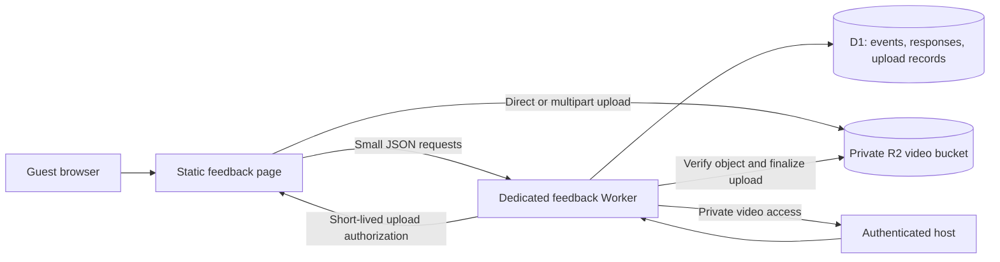

# Implementation update — 2026-09-11

The first implementation is now in `feedback/`; see [the runbook](../feedback/README.md). It uses Worker-mediated 5 MiB multipart uploads to enforce per-part byte limits, rather than exposing a direct unrestricted storage upload URL. Source is prepared for review; production resources and deployment are pending. The following records the original proposal.

# Reusable event feedback: recommendation and implementation brief

Prepared 2026-09-11. Status: proposal; no feedback page, backend, database, bucket, or migration has been deployed. The existing birthday timeline PR is separate.

## Recommendation

Keep the existing static website on GitHub Pages and add a dedicated Cloudflare Worker, D1 database, and private R2 bucket for feedback. The site already uses Workers and D1 for analytics; add an isolated feedback service rather than mixing personal feedback into the analytics database. Use the current plain HTML/CSS/JavaScript approach for the first form. A site-wide framework or hosting migration is unnecessary for this feature.

Suggested public routes are `/feedback/` for the reusable entry page and `/feedback/?event=sanya-2nd-birthday-2026` for this event. Use an event configuration/schema so future events can have different titles, dates, questions, options, and opening/closing times while preserving the questions attached to older answers.

## Guest form

| Field or question | Input | Required? |
| --- | --- | --- |
| Your name | Text | Yes |
| Email | Email | At least email or phone; both allowed |
| Phone | Telephone | At least phone or email; both allowed |
| How was your overall experience? | Exactly three choices: Loved it / It was okay / Could be better | Yes |
| Tell us more about your experience | Comment box | Optional; the overall choice is the compulsory answer |
| How was the food? | Same three choices, plus optional comment | No |
| Which food did you like most? | One choice: Pav bhaji / Pizza / Biryani | No |
| How were the decorations? | Same three choices, plus optional comment | No |
| How was the eggless cake? | Same three choices, plus optional comment | No |
| What did you like most? | Comment box | No |
| What could we improve / what did you not like? | Comment box | No |
| Biryani feedback | Dedicated comment box, with prompts about taste, spice, aroma, and texture | No |
| Biryani feedback video | One video, up to 8 minutes | No |

Optional questions must be skippable. Preserve the respondent's form data if an upload fails and let them submit written feedback without the video. Do not require an account for guests. Offer a clear success receipt after the server has saved the response, not simply after the upload started.

Default recommendation: feedback, contact details, and videos are private to the host. Public display requires a separate explicit decision and consent. Whether the user prefers private videos or public videos is awaiting their answer.

## Storage and request flow

Store answers, event/question versions, object keys, upload state, file size, duration, and timestamps in D1. Store the actual video files in R2, not in SQL rows, GitHub, or a server's local filesystem. Use separate storage permissions for public submission and private host access.

Save the feedback first, then attach an optional video through a bounded upload session. Use random server-generated object keys and short-lived, narrowly scoped upload authorization. Prefer multipart upload with retry for unreliable mobile connections. Verify the stored object before marking the attachment complete. Retrying a response or completion request must not duplicate it.

An eight-minute duration limit is separate from a byte-size limit. Proposed initial byte cap: 250 MB per video, configurable. Some eight-minute HD/4K phone videos exceed that cap and would need trimming or compression; make this clear before choosing a file. Check duration in the browser for immediate feedback and validate supported media metadata on the server before accepting the attachment. Reject unsupported or unverifiable media with an actionable error rather than trusting browser-supplied duration. Object storage does not transcode video; start with a limited set of tested formats, with download access for the host where playback is unsupported.

Quota design must account for concurrent upload reservations, multipart parts, abandoned uploads, and repeated use of signed URLs. A client-side file-size check or budget alert alone is not a hard spending limit. Choose upload-session limits, a total storage allowance, expiry, and cleanup before enabling public uploads. Never expose permanent upload credentials or public bucket listing.

## Cost and platform comparison

The following are published allowances checked on 2026-09-11, not a guarantee of zero bills. Existing account usage also consumes shared allowances.

- Cloudflare Workers Free: 100,000 requests/day and 10 ms CPU per invocation. Keep request work small; avoid server video transcoding. [Workers pricing](https://developers.cloudflare.com/workers/platform/pricing/)
- D1 Free: 5 GB total storage, 5 million rows read/day, and 100,000 rows written/day. [D1 pricing](https://developers.cloudflare.com/d1/platform/pricing/)
- R2 Standard: 10 GB-month storage, 1 million Class A and 10 million Class B operations/month included, with free egress. Additional storage is $0.015/GB-month, before other applicable charges. [R2 pricing](https://developers.cloudflare.com/r2/pricing/)
- R2 requires an R2 subscription checkout; it is usage-billed beyond included allowances. Whether a billing-enabled free tier is acceptable is awaiting the user's answer. [R2 setup](https://developers.cloudflare.com/r2/get-started/)
- Vercel Hobby is restricted to non-commercial personal use. A birthday-only app could be personal, but the full consulting site and future business reuse make Hobby a poor basis for a free site-wide migration. Vercel remains an alternative if a paid platform is preferred. [Hobby plan](https://vercel.com/docs/plans/hobby)
- Vercel Functions have a 4.5 MB payload limit. Large video uploads would still need direct object-storage uploads; moving to Vercel alone does not solve storage. [Direct uploads](https://vercel.com/kb/guide/how-to-bypass-vercel-body-size-limit-serverless-functions)
- Supabase Free includes 1 GB file storage, a 50 MB maximum file size, and pauses after one week of inactivity. It is less suitable for occasional events and eight-minute video uploads without additional storage or a paid plan. [Pricing](https://supabase.com/pricing), [file limits](https://supabase.com/docs/guides/storage/uploads/file-limits)

Illustrative storage: 40 files of 250 MB each total approximately 10 GB. An eight-minute recording at 4 megabits/second is approximately 240 MB before audio/container overhead. Duration alone therefore cannot predict capacity. Free storage is a total retained allowance, not an unlimited archive or 10 GB of additional permanent capacity every month.

## Host experience and maintenance

Provide a private host view to filter by event, read answers, see rating totals, export CSV, and play/download videos. Choose host authentication before implementation; do not embed an admin secret in the page or protect guest data only by an unlisted URL. Give the host a clear way to manage retention and deletion. Do not apply a destructive automatic retention rule without agreeing its duration with the user.

Record deployment and storage setup separately from code merges. Add migrations, local test instructions, API contracts, and the new service boundaries to the website README when implementation begins. The site's current architecture remains A7 until the new backend is actually introduced; this document is a proposal, not evidence of a live service.

## Recommended agent plan

1. Coordinator defines the event schema, API contract, privacy choices, upload limits, and integration order; owns architecture/context documentation.
2. Form agent owns the feedback page, responsive layout, required/optional behavior, accessible controls, and upload progress/retry UI.
3. Backend agent owns D1 migrations, response validation, idempotency, event versioning, and private host access.
4. Upload/review agent owns the R2 upload-session design, format/duration checks, quota accounting, abandoned-upload handling, and integration tests.

The form and backend agents can work in parallel after the contract is fixed. Avoid concurrent edits to shared schemas. Before release, test name/contact validation, exactly three overall choices, skipped optional questions, over-eight-minute and oversized videos, upload interruption/retry, duplicate submission, access to another guest's upload, private host access, and compatibility with existing site routes. Use synthetic test data only.

Recommended next decision: use the existing Cloudflare platform, keep uploads private, and confirm whether an R2 billing-enabled free tier is acceptable. This proposal does not authorize purchases, subscriptions, or production deployment.
